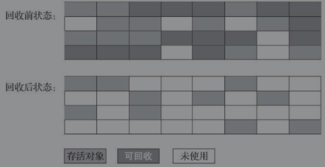
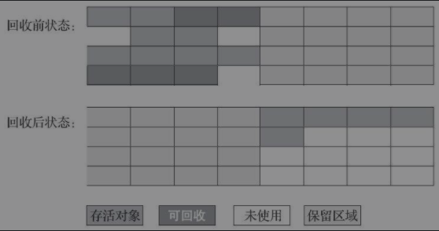
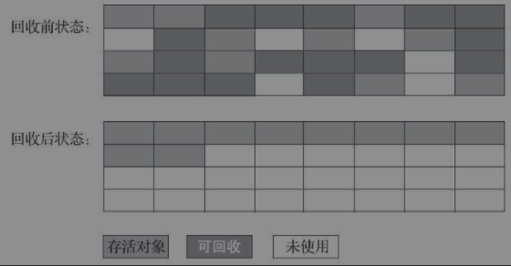

## GC
从回收内存的角度看，由于现代垃圾收集器大部分都是基于分代收集理论设计的，所以Java堆中经常会出现“新生代”“老年代”“永久代”“Eden空间”“From Survivor空间”“To Survivor空间”等名词，这些概念在本书后续章节中还会反复登场亮相，在这里者想先说明的是这些区域划分仅仅是一部分垃圾收集器的共同特性或者说设计风格而已，而非某个Java虚拟机具体实现的固有内存布局，更不是《Java虚拟机规范》里对Java堆的进一步细致划分 不少资料上经常写着类似于“Java虚拟机的堆内存分为新生代、老年代、永久代、Eden、Survivor……”这样的内容。在十年之前（以G1收集器的出现为分界），作为业界绝对主流的HotSpot虚拟机 它内部的垃圾收集器全部都基于“经典分代”来设计，需要新生代、老年代收集器搭配才能工作，在这种背景下，上述说法还算是不会产生太大歧义。但是到了今天，垃圾收集器技术与十年前不可同日而语，HotSpot里面也出现了不采用分代设计的新垃圾收集器，再按照上面的提法就有很多需要商榷的地方了。

垃圾回收需要完成的三件事
1. 哪些内存需要回收？
2. 什么时候回收？
3. 如何回收？

## 哪些内存需要回收？
* 程序计数器、虚拟机栈、本地方法栈 3个区域随线程而生，随线程而灭。Java堆和方法区两个区域有着显著的不确定性，垃圾回收器所关注的正式这部分内存如何管理。
* 如何确定哪些对象已死
  1. 引用计数法
     在对象中添加一个引用计数器，每当有一个地方引用它，计数器加一。当引用失效时，计数器减一。任何时刻计数器为零的对象就是不可能再被使用的。
     引用计数器很难解决对象之间相互引用的问题，Java虚拟机并不是通过引用计数算法来判断对象是否存活的.
  2. 可达性分析算法
     Java内存管理子系统都是通过可达性分析算法来判断熏香是否存活的
     这个算法的基本思路：通过一系列成为“GC Roots”的根休想作为起始节点集，从这些结点开始，根据引用关系向下搜索，如果某个对象到GC Roots没有任何引用链相连，也就是从GC Roots到这个对象不可达时，此对象不可能在被使用。
     固定可作为GC Roots的对象包括以下几种：
     1. 在虚拟机栈(栈帧中的本地变量表)中引用的对象
     2. 在方法区中类静态属性引用的对象。
     3. 在方法区中常量引用的对象
     4. Java虚拟机内部的引用，如基本数据类型对应的Class对象，一些常驻的异常对象（比如NullPointExcepiton、OutOfMemoryError）等，还有系统类加载器。
     5. 所有被同步锁（synchronized关键字）持有的对象。
     6. 反映Java虚拟机内部情况的JMXBean、JVMTI中注册的回调、本地代码缓存等。

     除了这些固定的GC Roots集合以外，根据用户所选用的垃圾收集器以及当前回收的内存区域不同，还可以有其他对象“临时性”地加入，共同构成完整GC Roots集合。
     譬如后文将会提到的分代收集，如果只针对Java堆中某一块区域发起垃圾收集时（如最典型的只针对新生代的垃圾收集），区域里的对象完全有可能被位于堆中其他区域的对象所引用，这时候就需要将这些关联区域的对象也一并加入GC Roots集合中去，才能保证可达性分析的正确性。
* 引用  
  在JDK 1.2版之后，Java对引用的概念进行了扩充，将引用分为强引用（StronglyRe-ference）、软引用（Soft Reference）、弱引用（Weak Reference）和虚引用（Phantom Reference）4种，这4种引用强度依次逐渐减弱。
  1. 强引用（StronglyRe-ference）
     强引用是最传统的“引用”的定义，是指在程序代码之中普遍存在的引用赋值，即类似“Object obj=new Object()”这种引用关系。无论任何情况下，只要强引用关系还存在，垃圾收集器就永远不会回收掉被引用的对象。
  2. 软引用（Soft Reference
     软引用是用来描述一些还有用，但非必须的对象。只被软引用关联着的对象，在系统将要发生内存溢出异常前，会把这些对象列进回收范围之中进行第二次回收，如果这次回收还没有足够的内存，才会抛出内存溢出异常
  3. 弱引用（Weak Reference
     弱引用也是用来描述那些非必须对象，但是它的强度比软引用更弱一些，被弱引用关联的对象只能生存到下一次垃圾收集发生为止。当垃圾收集器开始工作，无论当前内存是否足够，都会回收掉只被弱引用关联的对象。
  4. 虚引用（Phantom Reference）
     虚引用也称为“幽灵引用”或者“幻影引用”，它是最弱的一种引用关系。一个对象是否有虚引用的存在，完全不会对其生存时间构成影响，也无法通过虚引用来取得一个对象实例。为一个对象设置虚引用关联的唯一目的只是为了能在这个对象被收集器回收时收到一个系统通知。

### 回收方法区
* 有些人认为方法区（如HotSpot虚拟机中的元空间或者永久代）是没有垃圾收集行为的，《Java虚拟机规范》中提到过可以不要求虚拟机在方法区中实现垃圾收集，方法区垃圾收集的“性价比”通常也是比较低的。
* 方法区的垃圾收集主要回收两部分内容：废弃的常量和不再使用的类型。
  1. 废弃的常量
     举个常量池中字面量回收的例子，假如一个字符串“java”曾经进入常量池中，但是当前系统又没有任何一个字符串对象的值是“java”，换句话说，已经没有任何字符串对象引用常量池中的“java”常量，且虚拟机中也没有其他地方引用这个字面量。如果在这时发生内存回收，而且垃圾收集器判断确有必要的话，这个“java”常量就将会被系统清理出常量池。
  2. 不再使用的类型，需要满足下面三个条件：
     * 该类所有的实例都已经被回收，也就是Java堆中不存在该类及其任何派生子类的实例。
     * 加载该类的类加载器已经被回收，这个条件除非是经过精心设计的可替换类加载器的场景，如OSGi、JSP的重加载等，否则通常是很难达成的。
     * 该类对应的java.lang.Class对象没有在任何地方被引用，无法在任何地方通过反射访问该类的方法。

### 垃圾收集算法
#### 分代收集理论
* 分代收集建立在两个分代假说之上
  1. 绝大多数对象都是朝生夕灭的。
  2. 熬过越多次垃圾收集过程的对象就越难以消亡。
* 收集器应该将Java堆划分出不同的区域，然后将回收对象依据其年龄（年龄即对象熬过垃圾收集过程的次数）分配到不同的区域之中存储。如果一个区域中大多数对象都是朝生夕灭，每次回收时只关注如何保留少量存活而不是去标记那些大量将要被回收的对象，就能以较低代价回收到大量的空间；如果剩下的都是难以消亡的对象，虚拟机便可以使用较低的频率来回收这个区域，这就同时兼顾了垃圾收集的时间开销和内存的空间有效利用。
* Java虚拟机中的分代收集理论一般至少会把Java堆划分为新生代（Young Generation）和老年代（Old Generation）两个区域
* 分代收集并非只是简单划分一下内存区域那么容易，它至少存在一个明显的困难：对象不是孤立的，对象之间会存在跨代引用。如果某个新生代对象存在跨代引用，由于老年代对象难以消亡，该引用会使得新生代对象在收集时同样得以存活，进而在年龄增长之后晋升到老年代中，这时跨代引用也随即被消除了。在新生代上建立一个全局的数据结构（该结构被称为“记忆集”，Remembered Set），这个结构把老年代划分成若干小块，标识出老年代的哪一块内存会存在跨代引用。此后当发生Minor GC时，只有包含了跨代引用的小块内存里的对象才会被加入到GC Roots进行扫描。
* 什么时候对象从年轻代转移到老年代
    * 经历15此回收（15这个值可改变）
    * 大对象（字符串与数组），即超过了设定的值的对象，直接在老年代中分配
    * 首先根据 TargetSurvivorRatio 指定的比例，乘以 survivor 一个区的大小，得出目标晋升空间大小。然后将分代对象大小，按照分代年龄从小到大相加，直到大于目标晋升空间大小。之后，将得出的这个分代年龄以上的对象全部晋升。

### GC时机 (?)
1. YGC（Minor GC）的时机:
   * edn空间不足
2. FGC（Full GC）的时机：
   * old空间不足；
   * perm空间不足；
   * 显示调用System.gc() ，包括RMI等的定时触发;
   * YGC时的悲观策略；
   * dump live的内存信息时(jmap –dump:live)。

##### 各种GC定义
1. 新生代收集（Minor GC/Young GC）：指目标只是新生代的垃圾收集。
2. 老年代收集（Major GC/Old GC）：指目标只是老年代的垃圾收集。目前只有CMS收集器会有单独收集老年代的行为
3. 整堆收集（Full GC）：收集整个Java堆和方法区的垃圾收集。

### 垃圾回收算法
1. 标记-清除算法
   算法分为“标记”和“清除”两个阶段：首先标记出所有需要回收的对象，在标记完成后，统一回收掉所有被标记的对象，也可以反过来，标记存活的对象，统一回收所有未被标记的对象。  
   它的主要缺点有两个：第一个是执行效率不稳定，如果Java堆中包含大量对象，而且其中大部分是需要被回收的，这时必须进行大量标记和清除的动作，导致标记和清除两个过程的执行效率都随对象数量增长而降低；第二个是内存空间的碎片化问题，标记、清除之后会产生大量不连续的内存碎片，空间碎片太多可能会导致当以后在程序运行过程中需要分配较大对象时无法找到足够的连续内存而不得不提前触发另一次垃圾收集动作。
   
2. 标记-复制算法
    标记-复制算法常被简称为复制算法。为了解决标记-清除算法面对大量可回收对象时执行效率低的问题  
    它将可用内存按容量划分为大小相等的两块，每次只使用其中的一块。当这一块的内存用完了，就将还存活着的对象复制到另外一块上面，然后再把已使用过的内存空间一次清理掉。如果内存中多数对象都是存活的，这种算法将会产生大量的内存间复制的开销，但对于多数对象都是可回收的情况，算法需要复制的就是占少数的存活对象，而且每次都是针对整个半区进行内存回收，分配内存时也就不用考虑有空间碎片的复杂情况，只要移动堆顶指针，按顺序分配即可。这样实现简单，运行高效，不过其缺陷也显而易见，这种复制回收算法的代价是将可用内存缩小为了原来的一半，空间浪费未免太多了一点。  
    **针对具备“朝生夕灭”特点的对象，提出了一种更优化的半区复制分代策略，现在称为“Appel式回收”。**
    具体做法是把新生代分为一块较大的Eden空间和两块较小的Survivor空间，每次分配内存只使用Eden和其中一块Survivor。发生垃圾搜集时，将Eden和Survivor中仍然存活的对象一次性复制到另外一块Survivor空间上，然后直接清理掉Eden和已用过的那块Survivor空间。HotSpot虚拟机默认Eden和Survivor的大小比例是8∶1，也即每次新生代中可用内存空间为整个新生代容量的90%（Eden的80%加上一个Survivor的10%），只有一个Survivor空间，即10%的新生代是会被“浪费”的。  
    **当Survivor空间不足以容纳一次Minor GC之后存活的对象时**，就需要依赖其他内存区域（实际上大多就是老年代）进行分配担保（Handle Promotion）。如果另外一块Survivor空间没有足够空间存放上一次新生代收集下来的存活对象，这些对象便将通过分配担保机制直接进入老年代。
   
3. 标记-整理算法    
   标记-复制算法在对象存活率较高时就要进行较多的复制操作，效率将会降低。更关键的是，如果不想浪费50%的空间，就需要有额外的空间进行分配担保，以应对被使用的内存中所有对象都100%存活的极端情况，所以在老年代一般不能直接选用这种算法。
   其中的标记过程仍然与“标记-清除”算法一样，但后续步骤不是直接对可回收对象进行清理，而是让所有存活的对象都向内存空间一端移动，然后直接清理掉边界以外的内存
   如果移动存活对象，尤其是在老年代这种每次回收都有大量对象存活区域，移动存活对象并更新所有引用这些对象的地方将会是一种极为负重的操作。
 
## 思考
1. 新生代为什么有两个S区  
   因为复制算法需要有一个空白区用于存活对象转移，如果只有一个S区，当一次复制算法完成后，如果新对象存放到S区，就要使S区分配50%的空间才能接受新对象的创建，如果新对象分配到Eden区就会导致没有新的空白区完成下一次复制算法；只有存在两个S区才能保证，每次都有新的空白区存放存活对象，并且edge可以占用80%的空间存放新对象
2. 新生代为什么采用标记-复制算法而不是标记-整理算法  
   复制比移动时间复杂度更高？？（还没有找到确切答案）
3. 老年代为什么采用标记整理算法而不是标记-复制算法  
   因为老年代的特点是存活率比较高，标记复制算法在存活对象比较多的情况下，就需要分配更多的空白空间来完成复制过程，而不是新生代的8:1:1,会导致可分配空间大量减少

## 内存分配
#### 对象优先在Eden分配
大多数情况下，对象在新生代Eden区中分配。当Eden区没有足够空间进行分配时，虚拟机将发起一次Minor GC。
#### 大对象直接进入老年代
大对象就是指需要大量连续内存空间的Java对象，最典型的大对象便是那种很长的字符串，或者元素数量很庞大的数组，本节例子中的byte[]数组就是典型的大对象。大对象对虚拟机的内存分配来说就是一个不折不扣的坏消息，比遇到一个大对象更加坏的消息就是遇到一群“朝生夕灭”的“短命大对象”，我们写程序的时候应注意避免。在Java虚拟机中要避免大对象的原因是，在分配空间时，它容易导致内存明明还有不少空间时就提前触发垃圾收集，以获取足够的连续空间才能安置好它们，而当复制对象时，大对象就意味着高额的内存复制开销。
#### 长期存活的对象将进入老年代
HotSpot虚拟机中多数收集器都采用了分代收集来管理堆内存，那内存回收时就必须能决策哪些存活对象应当放在新生代，哪些存活对象放在老年代中。为做到这点，虚拟机给每个对象定义了一个对象年龄（Age）计数器，存储在对象头中。对象通常在Eden区里诞生，如果经过第一次Minor GC后仍然存活，并且能被Survivor容纳的话，该对象会被移动到Survivor空间中，并且将其对象年龄设为1岁。对象在Survivor区中每熬过一次Minor GC，年龄就增加1岁，当它的年龄增加到一定程度（默认为15），就会被晋升到老年代中。
#### 动态对象年龄判定
为了能更好地适应不同程序的内存状况，HotSpot虚拟机并不是永远要求对象的年龄必须达到-XX：MaxTenuringThreshold才能晋升老年代，如果在Survivor空间中相同年龄所有对象大小的总和大于Survivor空间的一半，年龄大于或等于该年龄的对象就可以直接进入老年代，无须等到-XX：MaxTenuringThreshold中要求的年龄。
#### 空间分配担保
在发生Minor GC之前，虚拟机必须先检查老年代最大可用的连续空间是否大于新生代所有对象总空间，如果这个条件成立，那这一次Minor GC可以确保是安全的。如果不成立，则虚拟机会先查看-XX：HandlePromotionFailure参数的设置值是否允许担保失败（Handle Promotion Failure）；如果允许，那会继续检查老年代最大可用的连续空间是否大于历次晋升到老年代对象的平均大小，如果大于，将尝试进行一次Minor GC，尽管这次Minor GC是有风险的；如果小于，或者-XX：HandlePromotionFailure设置不允许冒险，那这时就要改为进行一次FullGC。  
取历史平均值来比较其实仍然是一种赌概率的解决办法，也就是说假如某次MinorGC存活后的对象突增，远远高于历史平均值的话，依然会导致担保失败。如果出现了担保失败，那就只好老老实实地重新发起一次Full GC，这样停顿时间就很长了

## 并不是每次GC都要走完所有GC Roots（不太懂）
并不需要一个不漏地检查完所有执行上下文和全局的引用位置，虚拟机应当是有办法直接得到哪些地方存放着对象引用的。在HotSpot的解决方案里，是使用一组称为OopMap的数据结构来达到这个目的。一旦类加载动作完成的时候，HotSpot就会把对象内什么偏移量上是什么类型的数据计算出来，在即时编译过程中，也会在特定的位置记录下栈里和寄存器里哪些位置是引用。这样收集器在扫描时就可以直接得知这些信息了，并不需要真正一个不漏地从方法区等GC Roots开始查找。

### 资料
[Java对象循环引用，Java gc 如何回收](https://blog.csdn.net/leonardo9029/article/details/50241115)
[GC算法](https://www.cnblogs.com/feng9exe/p/7268524.html)