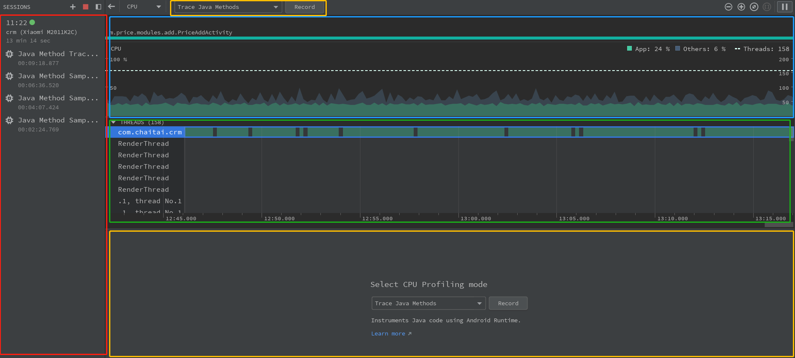

## CUP
#### 功能
* 查看各个线程占用的CUP资原
* 查看函数调用

[官网文档](https://developer.android.com/studio/profile/cpu-profiler#configurations)

如图所示
* 红色部分：历史Record记录
* 黄色部分：操作台用于发起Record
* 蓝色部分：当前CPU占用情况
* 绿色部分：各个线程占用CUP情况，由可知现在线程com.chaitai.crm （主线程）占用大量CPU资原

## MEMORY
#### 功能
* 查看内存占用情况
* 查看各个类的实例对象个数以及具体内容
* 查看垃圾回收触发时间

## NETWORK
#### 功能
* 查看网络占用情况
* 查看网络请求具体内容

## ENERGY